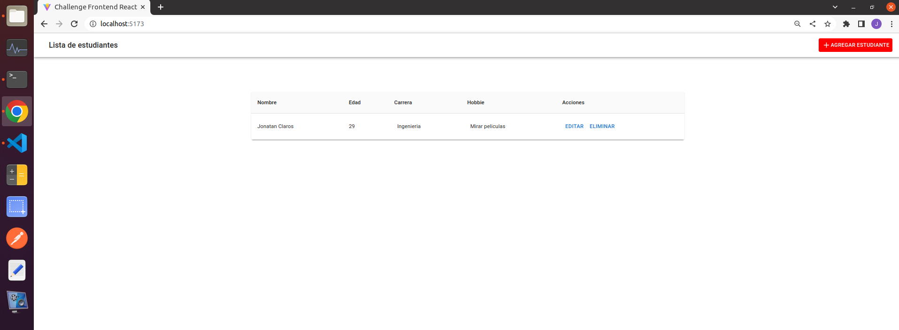

## Challenge - Frontend React.

Aplicacion para crear una lista de estudiantes, con un formulario para agregarlos y una lista para visualizarlos. Donde se podran editar y eliminar.

[DEMO]( )

## Description
Desarrollo de aplicacion en React con Typescript de una interfaz de usuario sencilla y funcional. Cuenta con: 

- CRUD de estudiantes
- Router para navegación entre las vistas
- Validaciones de formulario
- Modals de confirmacion/alerta
- Test Unitarios
- Test e2e
- Persistencia de datos
- Aclaracion: no cuenta con diseño mobil


## Herramientas
- React v18
- Typescript
- Styles: CSS + Material UI
- Estado global: useContext + useReducer
- Test Unitarios: Jest + Testing Library
- Test e2e: Cypress
- Router: React-Router-Dom v6
- Modals: SweetAlert2
- Host : Vercel
- Persistencia de datos: localStorage

## Images





## Intalacion y ejecucion
```
npm install
npm run dev
```

### Test de la aplicacion
#### Test Unitarios
```
npm run test
```

#### Test e2e
```
npm run test:e2e-doc
```


